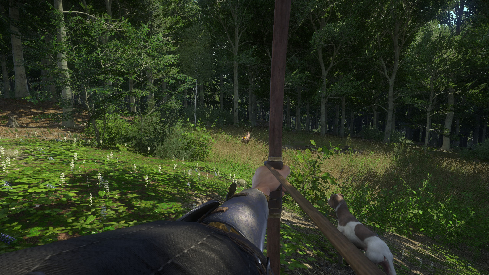

# Reticle for bows - A mod for Kingdom Come: Deliverance

This extremely simple mod enables the game setting `wh_pl_ShowFireCursor`, which makes the dot reticle visible even when holding a bow. (By default, the reticle shows only with bare hands and melee weapons.)



## Installation

Download a release package or build the mod yourself, then copy the mod directory (`reticle_for_bows`) inside the game's Mods directory.

This is the tree structure you should have:
```text
<Game install directory>   <-- Depends on your platform.
└── Mods\
    ├── mod_order.txt      <-- Add the mod directory name inside!
    └── reticle_for_bows\
        ├── Data\
        │   └── data.pak
        └── mod.manifest
```

Finally, ensure that the name of the mod directory is present in `mod_order.txt`.

That's it.

## Development

On Windows, use Powershell to run the helper scripts. 7zip and robocopy are required.

### Building
```powershell
.\build.ps1
```
➥ Creates the `.pak`, and put everything together in the `build\` directory. This is what you can deploy or distribute.

### Deploying in the game
```powershell
.\deploy.ps1
```
➥ Runs the build script, then copies the mod files to the game's `Mods\` directory, and adds an entry to `mod_order.txt` if needed.

### Creating a release package
```powershell
.\release.ps1
```
➥ Runs the build script, then packages the mod files from `build\` into a `.zip` archive using this naming scheme: `<mod name> v<version>.zip`. Release packages are stored in the `releases\` directory. This is the package you should submit to a mod hosting platform.

## Multiple similar mods already exist, why create a new one?

With this little project I just wanted to learn how to make a basic mod for Kingdom Come: Deliverance. 🙂

An additional motivation to make this mod is that this one does not require any further action from the player (you), unlike other similar mods that require editing a `user.cfg` or an `autoexec.cfg`. Consequently, they are not compatible with Vortex (Nexus' mod manager). This one is plug-and-play!
